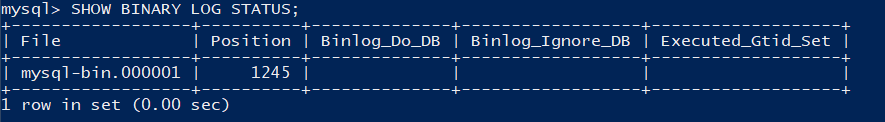
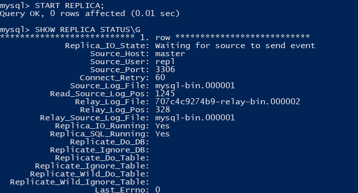
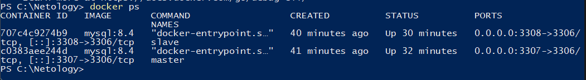
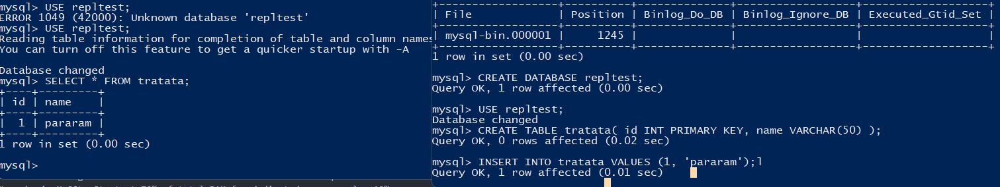

# Домашнее задание к занятию "`Репликация и масштабирование. Часть 1`" - `Макаров Виктор`

### Инструкция по выполнению домашнего задания

   1. Сделайте `fork` данного репозитория к себе в Github и переименуйте его по названию или номеру занятия, например, https://github.com/имя-вашего-репозитория/git-hw или  https://github.com/имя-вашего-репозитория/7-1-ansible-hw).
   2. Выполните клонирование данного репозитория к себе на ПК с помощью команды `git clone`.
   3. Выполните домашнее задание и заполните у себя локально этот файл README.md:
      - впишите вверху название занятия и вашу фамилию и имя
      - в каждом задании добавьте решение в требуемом виде (текст/код/скриншоты/ссылка)
      - для корректного добавления скриншотов воспользуйтесь [инструкцией "Как вставить скриншот в шаблон с решением](https://github.com/netology-code/sys-pattern-homework/blob/main/screen-instruction.md)
      - при оформлении используйте возможности языка разметки md (коротко об этом можно посмотреть в [инструкции  по MarkDown](https://github.com/netology-code/sys-pattern-homework/blob/main/md-instruction.md))
   4. После завершения работы над домашним заданием сделайте коммит (`git commit -m "comment"`) и отправьте его на Github (`git push origin`);
   5. Для проверки домашнего задания преподавателем в личном кабинете прикрепите и отправьте ссылку на решение в виде md-файла в вашем Github.
   6. Любые вопросы по выполнению заданий спрашивайте в чате учебной группы и/или в разделе “Вопросы по заданию” в личном кабинете.
   
Желаем успехов в выполнении домашнего задания!
   
### Дополнительные материалы, которые могут быть полезны для выполнения задания

1. [Руководство по оформлению Markdown файлов](https://gist.github.com/Jekins/2bf2d0638163f1294637#Code)

---

## Задание 1
На лекции рассматривались режимы репликации master-slave, master-master, опишите их различия.

Ответить в свободной форме.

## Задание 2
Выполните конфигурацию master-slave репликации, примером можно пользоваться из лекции.

Приложите скриншоты конфигурации, выполнения работы: состояния и режимы работы серверов.

Запустил два контейнера.

Добавил их в одну сеть

Внёс конфигурации, продемонстрированные в лекции в my.cnf для мастера и для слейва

Добавил юзера, дал права на репликацию в мастере

Узнал бинарник журнала репликации в мастере для передачи его в слейва.

Команда для подключения слейва к мастеру
``CHANGE REPLICATION SOURCE TO
  SOURCE_HOST='master',
  SOURCE_USER='repl',
  SOURCE_PASSWORD='password',
  RELAY_LOG_POS=1245;``
Проверка статуса показывает, что всё работает, подключение есть, слейв ожидае изменений в мастере.

Контейнеры работают

Демонстрация репликации базы данных. В левом окне слейва сперва неудачная попытка использования базы данных repltest, т.к. её ещё не существует. 
В правом окне создаётся база данных в мастере, создаётся табличка.
В левом окне успешное чтение базы данных и созданной таблицы.

